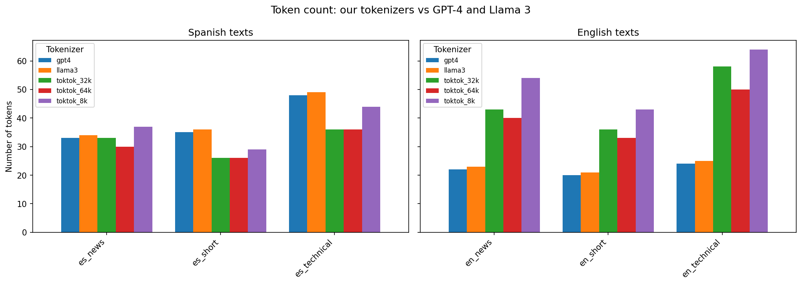
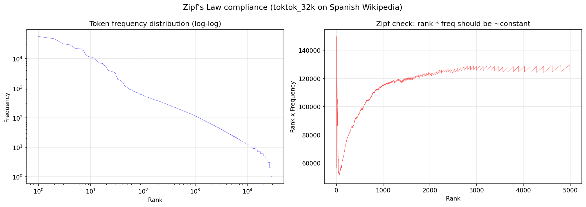
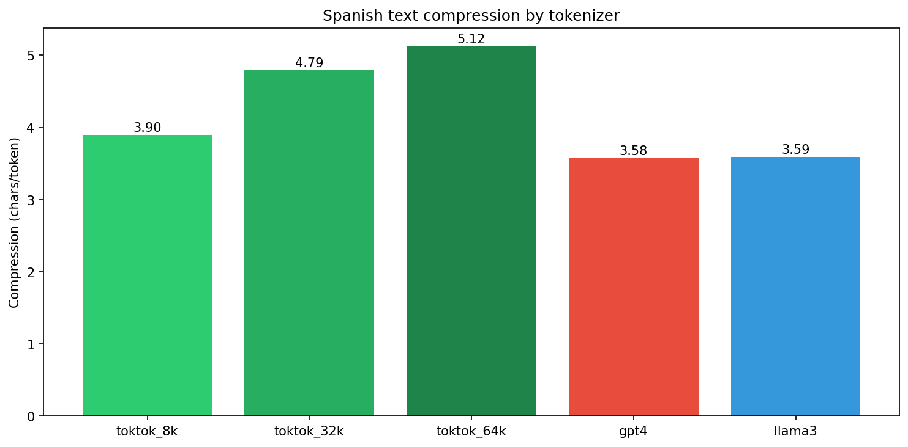

<p align="center">
  
  <h1 align="center">TokTok</h1>
</p>

<p align="center">
  A BPE tokenizer optimized for Spanish, trained from scratch with SentencePiece.
</p>

<p align="center">
  <a href="https://huggingface.co/marcelo-earth/toktok-es-32k">HuggingFace</a> &middot;
  <a href="#results">Results</a> &middot;
  <a href="#quickstart">Quickstart</a>
</p>

---

## Why?

Most LLM tokenizers (GPT-4, Llama) were trained on English-heavy data. On Spanish text, they produce **20-40% more tokens** than necessary — making inference slower and more expensive.

TokTok trains a BPE tokenizer specifically for Spanish and benchmarks it against GPT-4 (`tiktoken`) and Llama 3 tokenizers across multiple vocabulary sizes.

## Key Findings

- **20-40% fewer tokens** on Spanish text compared to GPT-4 and Llama tokenizers
- **32K vocab is the sweet spot** — diminishing returns beyond that for Spanish
- **Healthy vocab distribution** — token frequencies follow Zipf's law
- **Llama 3 > GPT-4 for Spanish** — thanks to more multilingual training data

## Pre-trained Models

| Vocab Size | HuggingFace | Use Case |
|:----------:|-------------|----------|
| **8K** | [toktok-es-8k](https://huggingface.co/marcelo-earth/toktok-es-8k) | Lightweight, resource-constrained environments |
| **32K** | [toktok-es-32k](https://huggingface.co/marcelo-earth/toktok-es-32k) | Recommended for most use cases |
| **64K** | [toktok-es-64k](https://huggingface.co/marcelo-earth/toktok-es-64k) | Maximum compression, larger memory footprint |

### Usage

```python
import sentencepiece as spm

sp = spm.SentencePieceProcessor()
sp.load("tokenizer.model")

text = "El procesamiento de lenguaje natural es fascinante."
tokens = sp.encode_as_pieces(text)
# ['▁El', '▁procesamiento', '▁de', '▁lenguaje', '▁natural', '▁es', '▁fascinante', '.']
```

## Quickstart

### Install

```bash
pip install -r requirements.txt
```

### Download corpus

```bash
python download_data.py
```

Downloads ~100K Spanish Wikipedia articles to `data/es_wiki.txt`.

### Train

```bash
python train_tokenizer.py --vocab-size 32000
```

| Flag | Default | Description |
|------|---------|-------------|
| `--input` | `data/es_wiki.txt` | Path to training text |
| `--vocab-size` | `32000` | Target vocabulary size |
| `--model-type` | `bpe` | `bpe` or `unigram` |
| `--output-dir` | `models` | Where to save `.model` and `.vocab` |
| `--test` | off | Run a quick sanity check after training |

### Evaluate

Open `toktok.ipynb` to reproduce all comparisons and plots.

## Results

### Compression Comparison

How many tokens each tokenizer needs for the same Spanish text (fewer is better):



### Zipf's Law

A healthy tokenizer should have token frequencies that follow Zipf's law — our vocabulary distribution confirms this:



### Vocab Sweet Spot

Compression ratio across vocabulary sizes — 32K hits the point of diminishing returns:



## How It Works

1. **Corpus** — Download Spanish Wikipedia (~100K articles) via the HuggingFace `datasets` library
2. **Training** — Train BPE tokenizers at 8K, 32K, and 64K vocab sizes using SentencePiece with 99.95% character coverage and byte fallback
3. **Benchmarking** — Compare compression ratios against `tiktoken` (GPT-4) and Llama 3's tokenizer on the same Spanish text
4. **Analysis** — Validate vocabulary health via Zipf's law and find the optimal vocab size for bilingual EN/ES workloads

## Project Structure

```
tok-tok/
├── download_data.py        # Corpus download script
├── train_tokenizer.py      # SentencePiece BPE training
├── upload_to_hf.py         # Upload models to HuggingFace Hub
├── toktok.ipynb            # Full analysis and visualizations
├── models/                 # Trained tokenizer files
├── plots/                  # Generated comparison plots
├── data/                   # Training corpus (not tracked)
└── requirements.txt
```

## License

MIT
